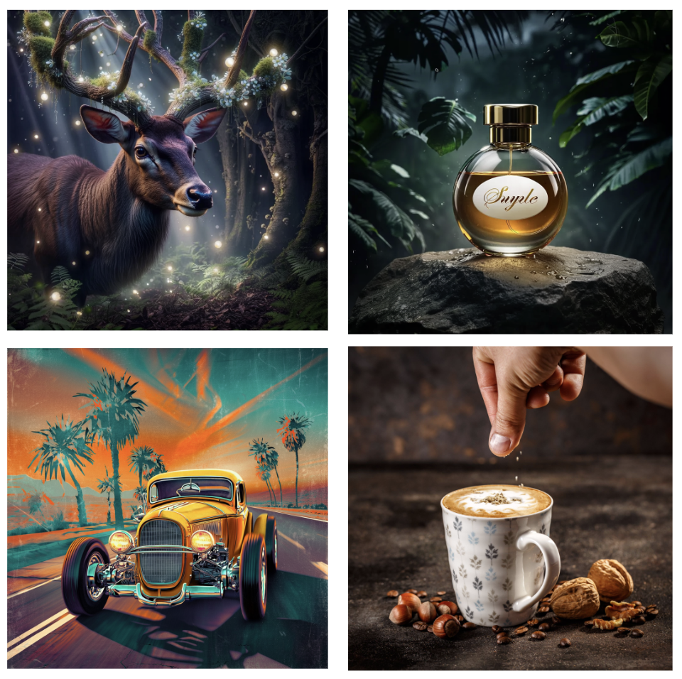

<p align="center">
  
</p>

<p align="center">
  <!-- GitHub Repo -->
  <a href="https://huggingface.co/briaai/FIBO" target="_blank">
    
  </a>
  &nbsp;

  <!-- Hugging Face Demo -->
  <a href="https://huggingface.co/spaces/briaai/FIBO" target="_blank">
    
  </a>
  &nbsp;

  <!-- FIBO Demo on Bria (replace URL if you have a specific demo link) -->
  <a href="https://platform.bria.ai/labs/fibo" target="_blank">
    
  </a>
  &nbsp;

  <!-- Bria Platform -->
  <a href="https://platform.bria.ai" target="_blank">
    
  </a>
  &nbsp;

  <!-- Bria Discord -->
  <a href="https://discord.com/invite/Nxe9YW9zHS" target="_blank">
    
  </a>
</p>
<p align="center">
  
</p>

<p align="center">
  <b>FIBO is the first open-source, JSON-native text-to-image model trained exclusively on long structured captions.</b>
  <br><br>
  <i>Fibo sets a new standard for controllability, predictability, and disentanglement.</i>
</p>

<!-- ===================== MAIN CONTENT ===================== -->

<h2>🌍 What's FIBO?</h2>
<p>Most text-to-image models excel at imagination—but not control. <b>FIBO</b> is built for professional workflows, not casual use. Trained on <b>structured JSON captions up to 1,000+ words</b>, FIBO enables precise, reproducible control over lighting, composition, color, and camera settings. The structured captions foster native disentanglement, allowing targeted, iterative refinement without prompt drift. With only <b>8B parameters</b>, FIBO delivers high image quality, strong prompt adherence, and professional-grade control—<b>trained exclusively on licensed data</b>.</p>

<h2>🔑 Key Features</h2>
<ul>
  <li><b>VLM guided JSON-native prompting</b>: Incorporates any VLM to transform short prompts into structured schemas with 1,000+ words (lighting, camera, composition, DoF).</li>
  <li><b>Iterative controlled generation</b>: generate images from short prompts or keep refining and get inspiration from detailed JSONs and input images</li>
  <li><b>Disentangled control</b>: tweak a single attribute (e.g., camera angle) without breaking the scene.</li>
  <li><b>Enterprise-grade</b>: 100% licensed data; governance, repeatability, and legal clarity.</li>
  <li><b>Strong prompt adherence</b>: high alignment on PRISM-style evaluations.</li>
  <li><b>Built for production</b>: API endpoints (Bria Platform, Fal.ai, Replicate), ComfyUI nodes, and local inference.</li>
</ul>

<h2>🎨 Work with FIBO in Three Simple Modes</h2>

<ul>
  <li>
    <b>Generate:</b> Start with a quick idea. FIBO’s language model expands your short prompt into a rich, structured JSON prompt, then generates the image. 
    You get both the image and the expanded prompt.
  </li>
  <li>
    <b>Refine:</b> Continue from a detailed structured prompt add a short instruction - for example, “backlit,” “85 mm,” or “warmer skin tones.” 
    FIBO updates <i>only</i> the requested attributes, re-generates the image, and returns the refined prompt alongside it.
  </li>
  <li>
    <b>Inspire:</b> Provide an image instead of text. FIBO’s vision–language model extracts a detailed, structured prompt, blends it with your creative intent, and produces related images—ideal for inspiration without overreliance on the original.
  </li>
</ul>
<h2> News</h2>
<ul>
  <li>2025-11-11: Fine-tuning code is now available [here](src/fine_tuning/README.md)! 🎉</li>
  <li>2025-11-10: Add support for TeaCache to speed up generation by 3x with minimal quality loss 🏎️</li>
</ul>

<h2>⚡ Quick Start</h2>

</p>

<p align="center">
  <a href="https://huggingface.co/spaces/briaai/FIBO" target="_blank" style="text-decoration:none;">
    🚀 Try FIBO now →
  </a>
</p>

<p>FIBO is available everywhere you build, either as source-code and weights, ComfyUI nodes or API endpoints.</p>

<p><b>API Endpoint:</b></p>
<ul>
  <li><a href="https://docs.bria.ai/image-generation/v2-endpoints/image-generate">Bria.ai</a></li>
  <li><a href="https://fal.ai/models/bria/fibo/generate">Fal.ai</a></li>
  <li><a href="https://replicate.com/bria/fibo">Replicate</a></li>
</ul>

<p><b>ComfyUI:</b>
<ul>
  <li><a href="https://github.com/Bria-AI/ComfyUI-BRIA-API/blob/main/nodes/generate_image_node_v2.py">Generate Node</a></li>
  <li><a href="https://github.com/Bria-AI/ComfyUI-BRIA-API/blob/main/nodes/refine_image_node_v2.py">Refine Node</a></li>
</ul></p>

<p><b>Source-Code & Weights</b></p>

<ul>
  <li>The model is open source for non-commercial use with <a href="https://creativecommons.org/licenses/by-nc/4.0/deed.en">this license</a> </li>
  <li>For commercial use <a href="https://bria.ai/contact-us?hsCtaAttrib=114250296256">Click here</a>.</li>
</ul>
    
<h2>Quick Start Guide</h2>
<ol>
  <li>
    <p>Clone the repo</p>
    <pre><code class="language-bash">git clone https://github.com/Bria-AI/FIBO.git
cd FIBO
</code></pre>
  </li>
  <li>
  <p>Login to Hugging Face:</p>
  <p>
    Request model access at <a href="https://huggingface.co/briaai/FIBO" target="_blank">this link</a>
  </p>
  <pre><code class="language-bash">hf auth login</code></pre>
  </li>
  <li>
    <p>Install <code>uv</code>:</p>
    <p>Instructions taken from <a href="https://docs.astral.sh/uv/getting-started/installation/">here</a>.</p>
    <p>For linux systems this should be:</p>
    <pre><code class="language-bash">curl -LsSf https://astral.sh/uv/install.sh | sh
source $HOME/.local/bin/env
</code></pre>
  </li>
  <li>
    <p>Install the dependencies:</p>
    <pre><code class="language-bash">uv sync
</code></pre>
  </li>
  <li>
    <p>Activate your <code>.venv</code> and set the Python env:</p>
    <pre><code class="language-bash">source .venv/bin/activate
export PYTHONPATH=${PYTHONPATH}:${PWD}
</code></pre>
  </li>
</ol>

## Development

This project uses a `Makefile` to streamline common development tasks.

To install dependencies and set up pre-commit hooks, run:

```bash
make install
```

The following commands are also available:

*   `make lint`: Run linters to check for code quality.
*   `make format`: Format the code according to the project's style guidelines.
*   `make check`: Run both linters and formatters.
*   `make clean`: Remove the virtual environment.
*   `make help`: Display a list of all available commands.

<h3>Gemini Setup</h3>

<p>To use Gemini as the Vision-Language Model (VLM) backend for FIBO, some additional setup is needed.</p>

<ol>
  <li>
    <p><b>Obtain a Gemini API Key</b><br/>
    Sign up for the <a href="https://aistudio.google.com/app/apikey">Google AI Studio (Gemini)</a> and create an API key.</p>
  </li>
  <li>
    <p><b>Set the API Key as an Environment Variable</b><br/>
    Store your Gemini API key in the <code>GOOGLE_API_KEY</code> environment variable:</p>
    <pre><code class="language-bash">export GOOGLE_API_KEY=your_google_api_key
</code></pre>
    <p>You can add the above line to your <code>.bashrc</code>, <code>.zshrc</code>, or similar shell profile for persistence.</p>
  </li>
</ol>
<h3>Generate</h3>

<p>FIBO uses a VLM that transforms short prompts into detailed structured prompts that are used to generate images. You can use the following code to generate images using Gemini via the Google API - **requires a GOOGLE_API_KEY**, or use --model-mode local to use the local VLM instead (FIBO-VLM):</p>

```bash
python generate.py --prompt "A hyper-detailed, ultra-fluffy owl sitting in the trees at night, looking directly at the camera with wide, adorable, expressive eyes. Its feathers are soft and voluminous, catching the cool moonlight with subtle silver highlights. The owl's gaze is curious and full of charm, giving it a whimsical, storybook-like personality." --seed 1 --output examples/outputs/generate.png
```

<p>To use the local VLM (FIBO-VLM) instead of Gemini, add <code>--model-mode local</code> to the command.</p>

```bash
python generate.py --prompt "A hyper-detailed, ultra-fluffy owl sitting in the trees at night, looking directly at the camera with wide, adorable, expressive eyes. Its feathers are soft and voluminous, catching the cool moonlight with subtle silver highlights. The owl's gaze is curious and full of charm, giving it a whimsical, storybook-like personality." --seed 1 --output examples/outputs/generate.png --model-mode local
```

<p></p>


<h3>Refine</h3>
<p>FIBO supports iterative generation. Given a structured prompt and an instruction, FIBO refines the output.</p>

```bash
python generate.py --structured-prompt examples/outputs/generate.json --prompt "make the owl brown" --output examples/outputs/refine.png
```
<table align="center">
  <tr>
    <td><figcaption>Make owl brown</figcaption></td>
    <td><figcaption>Turn owl into a lemur</figcaption></td>
  </tr>
  <tr>
    <td><figcaption>Add jungle vegetation</figcaption></td>
    <td><figcaption>Add sunlight</figcaption></td>
  </tr>
</table>

<h3>Inspire</h3>
<p>Start from an image as inspiration and let Fibo regenerate a variation of it or merge your creative intent into the next generation</p>

```bash
python generate.py --image-path assets/original.png --output examples/outputs/inspire.png
```
```bash
python generate.py --image-path assets/original.png --prompt "Make futuristic" --output examples/outputs/inspire-prompt.png
```

<table align="center">
  <tr>
    <td><figcaption>original image</figcaption></td>
    <td><figcaption>No prompt</figcaption></td>
    <td><figcaption>Make futuristic</figcaption></td>
  </tr>
</table>

<h3> Faster Inference with TeaCache</h3>
<p>Enable TeaCache to speed up generation by <b>3x</b> with minimal quality loss:</p>

```bash
python generate.py --prompt "your prompt" --enable-teacache
```

<p>Adjust the threshold for speed/quality tradeoff (default 1.0, recommended 0.6-1.0):</p>

```bash
python generate.py --prompt "your prompt" --enable-teacache --teacache-threshold 0.8
```

<table align="center">
  <tr>
    <td><figcaption>Without TeaCache (baseline)</figcaption></td>
    <td><figcaption>With TeaCache (3x faster)</figcaption></td>
  </tr>
</table>

<p>see the examples in the <a href="examples">examples</a> directory for more details.</p>

<h2>🧠 Training and Architecture</h2>

<p><strong>FIBO</strong> is an 8B-parameter DiT-based, flow-matching text-to-image model trained <strong>exclusively on licensed data</strong> and on <strong>&gt;long, structured JSON captions</strong> (~1,000 words each), enabling strong prompt adherence and professional-grade control. It uses <strong>SmolLM3-3B</strong> as the text encoder with a novel <strong>DimFusion</strong> conditioning architecture for efficient long-caption training, and <strong>Wan 2.2</strong> as the VAE. The structured supervision promotes native disentanglement for targeted, iterative refinement without prompt drift, while VLM-assisted prompting expands short user intents, fills in missing details, and extracts/edits structured prompts from images using our fine-tuned <strong>Qwen-2.5</strong>-based VLM or <strong>Gemini 2.5 Flash</strong>. For reproducibility, we provide the assistant system prompt and the structured-prompt JSON schema across the “Generate,” “Refine,” and “Inspire” modes.</p>
<p></p>


<h2 id="data-distribution">Data Distribution</h2>

<p>FIBO was trained on curated set of image–caption pairs selected from ~1B image dataset as shown in the dataset distribution. All assets are vetted for commercial use, attribution traceability, and regional compliance under GDPR and the EU AI Act. This broad and balanced dataset ensures FIBO’s ability to generalize across a wide range of visual domains, from realistic human imagery to graphic design and product visualization, while maintaining full licensing compliance.</p>

<p></p>

<h2 id="Evaluation">Evaluation</h2>

<!-- ===================== BENCHMARK TABLE FIGURE ===================== -->
<h3 id="PRISM Benchmark model-comparison">PRISM Benchmark Model Comparison</h3>

<p>Using a licensed-data subset of PRISM-Bench, we evaluate image–text alignment and aesthetics. <strong>FIBO</strong> outperforms comparable open-source baselines, suggesting strong prompt adherence, controllability and aesthetics from structured-caption training.</p>


<h2 id="More Samples">More Samples</h2>

<p>Generate</p>
<div class="image-row">
  <figure>
    
  </figure>
</div>

<p>Inspire & Refine</p>
<div class="image-row">
  <figure>
  
  </figure>
</div>

<h2> 💬 Contact Us</h2>
<p>If you have questions about this repository, feedback to share, or want to contribute directly, we welcome your issues and pull requests on GitHub. Your contributions help make FIBO better for everyone.</p>

<p>If you're passionate about fundamental research, we're hiring full-time employees (FTEs) and research interns. Don't wait - reach out to us at <a href="mailto:hr@bria.ai">hr@bria.ai</a></p>

## Citation

We kindly encourage citation of our work if you find it useful.

```bibtex
@misc{gutflaish2025generating,
  title         = {Generating an Image From 1,000 Words: Enhancing Text-to-Image With Structured Captions},
  author        = {Gutflaish, Eyal and Kachlon, Eliran and Zisman, Hezi and Hacham, Tal and Sarid, Nimrod and Visheratin, Alexander and Huberman, Saar and Davidi, Gal and Bukchin, Guy and Goldberg, Kfir and Mokady, Ron},
  year          = {2025},
  eprint        = {2511.06876},
  archivePrefix = {arXiv},
  primaryClass  = {cs.CV},
  doi           = {10.48550/arXiv.2511.06876},
  url           = {https://arxiv.org/abs/2511.06876}
}
```

<p align="center"><b>🤗 <a href="https://huggingface.co/briaai/FIBO " target="_blank">Like FIBO on Hugging Face</a> to support responsible generative AI!</b></p>
